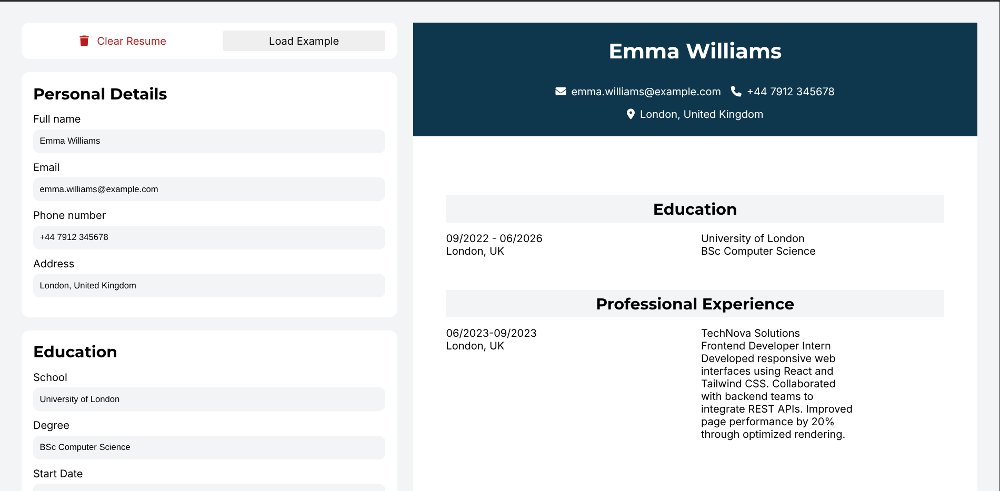

# CV Application

A lightweight React project that allows users to create and preview a resume in real time.
The application includes forms for entering personal information, education, and work experience, with an instant live preview on the right side.

Live Demo:
**[https://ruthzu.github.io/CV-Application/](https://ruthzu.github.io/CV-Application/)**

## Features

- Form inputs for personal details, education, and experience
- Live resume preview
- Option to clear all fields or load example data
- Clean and responsive layout
- Built with React and Vite

## Technologies Used

- React
- Vite
- CSS
